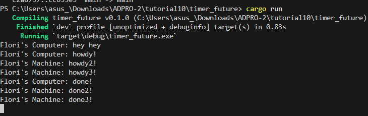
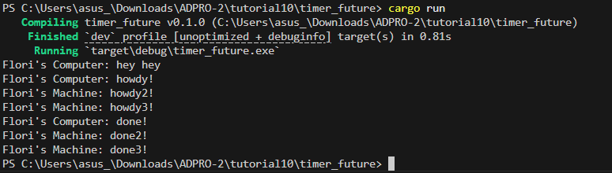

# Advanced Programming Module 10

## Reflection

### Experiment 1.2:

The printing order is "hey hey", "howdy!", then "done!" because spawner.spawn schedules the async task but doesn't run it immediately. The main thread then prints "hey hey" right after spawning the task. When executor.run() is called, the program then prints "howdy!", waits for the timer, and prints "done!".

### Experiment 1.3:
#### Without drop spawner

#### With drop spawner

When I comment out drop(spawner), the executor never sees the end of the tasks, so it waits forever for more tasks to be spawned and does not exit on its own. When I leave drop(spawner) in, the spawner is dropped after spawning all tasks, and it tells the executor that no more tasks will arrive, so it exits cleanly after running all the queued tasks.