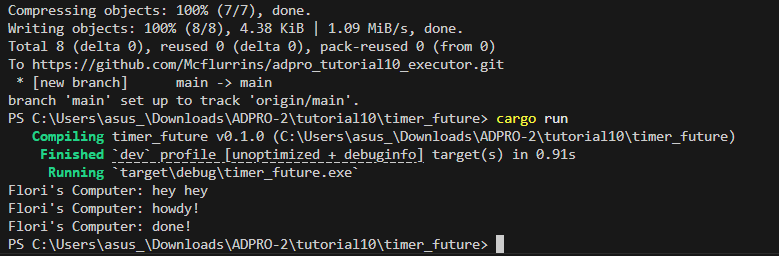

# Advanced Programming Module 10

### Reflection

#### Experiment 1.2:

The printing order is "hey hey", "howdy!", then "done!" because spawner.spawn schedules the async task but doesn't run it immediately. The main thread then prints "hey hey" right after spawning the task. When executor.run() is called, the program then prints "howdy!", waits for the timer, and prints "done!".